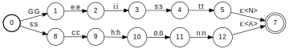

layout: true
  
<div class="my-header"></div>

<div class="my-footer">
  <table>
    <tr>
      <td>CLARIN-D &ndash; Common Language Resources and Technology Infrastructure</td>
      <td style="text-align:right"><a href="https://www.clarin-d.net/">www.clarin-d.net</a></td>
    </tr>
  </table>
</div>

---

class: title-slide

# Digitale Werkzeuge für die Zeitgeschichte:
## Eine Einführung in die digitale Hermeneutik und das Textmining

| Thomas Werneke  | Kay-Michael Würzner |
|:---------------:|:-------------------:|
| [werneke@zzf-potsdam.de](mailto:werneke@zzf-potsdam.de) | [wuerzner@bbaw.de](mailto:wuerzner@bbaw.de) |

---

# Überblick

---

# Digital turn?

- *Was sind Digitale Geisteswissenschaften?*
    + Neue Arbeitsweisen?
    + Neue Methodiken?
    + Eine neue Disziplin?

- *Alle arbeiten bereits „digital“*
    + mit Smartboards, Lernplattformen und digitalen Bildungsmedien
    + mit Online‐Katalogen der Bibliotheken und fachlichen Onlineportalen (z.B. HSozKult)
    + mit digitalen Werkzeugen (wie Googles „Ngram‐Viewer“)

---

# Google _Ngram_ – Fluch oder Segen?

:::info
Fallbeispiel: `love=>*_noun` im „English“-Korpus 
(10 häufigtsten Nomen in der Nähe von „love“)
:::


---

class: title-slide

# Linguistische Annotation

---

# Linguistische Annotation

- Zum Begriff der Linguistischen Annotation
    + Auszeichnung bestimmter linguistischer Eigenschaften
    + Bezug zu einer Einheit des Textes:
        * **Wort**: Silbenstruktur, morphologische Zerlegung, lexikalische
Semantik etc.
        * *Wortgruppe*: Mehrwortausdrücke, Namen, Kollokationen etc.
        * *Phrase*: syntaktische Kategorie, syntaktische Funktion
        * *Satz*: syntaktische Struktur, Satzsemantik, Funktion im Text (?)
    + *manuelle* vs. *automatische* Annotation
- Annotation von Korpora
    + Strukturierung und Anreicherung der Rohtexte zum Zwecke
        * besserer Durchsuchbarkeit
        * einfacherer Belegidentifikation
        * moderner Korpuspräsentationsformen
        * quantitativer Auswertungen
    + Korpusumfang bedingt vollautomatische Analysekette

---

# Linguistische Annotation

- Beispiel:

---

# Linguistische Annotation

- Analysekette:
    + Zerlegung des Fließtextes in Wörter und Sätze: **Tokenisierung**
    + Bestimmung der Grundform der Wörter: **Lemmatisierung**
    + Bestimmung der tatsächlichen Wortart eines Wortes: **PoS-Tagging**
    + Klassifizierung der Beziehungen der Wörter untereinander: **Dependenzparsing**
- vollautomatisch möglich (mit akzeptabler Qualität)
- zwei grundsätzliche Ansätze der Modellierung:
    + auf Basis von Expertenwissen **manuell** erstellte Regeln
    + auf Basis manuell erstellter Beispiele **automatisch** induzierte Regeln

---

# Tokenisierung

- Unterteilung von Fließtext in **Wörter** (bzw. *Tokens*) und **Sätze**
- (Vor-)Klassifizierung der Tokens zur Beschleunigung der morphologischen Analyse
    + Abkürzungen
    + Zahlen
    + Sonderzeichen
    + Fremdalphabete
- Normalisierung der Worttrennung
- Ansatz: Trennung an Leerraum
- im DWDS: statistischer Ansatz, **überwachtes Lernen**

---

# Tokenisierung

Problembereich *Satz*
```
Nach einer Schätzung des Industrieministeriums sind es mehr als 800.
»Österreich wurde alleingelassen in Europa«, beschwerte sich SPÖ-
Zentralsekretär Josef Cap.
SZ: Auf die Wahlerfolge der rechtsradikalen Parteien ...
```
Problembereich *Token*
```
Kaiser's-Netz → Kaiser 's-Netz
Jeanne d'Arc → Jeanne d' Arc
mm. → mm. [ORD]
CDU/CSU → CDU / CSU
(Verwaltungs-)Personal → ( Verwaltungs- ) Personal
```

---

# Morphologische Analyse

- Aufgabe
    + Bestimmung der **möglichen** Wortarten eines Wortes
      ```
      grünen ↦ {Verb, Adjektiv}
      Müller ↦ {Substantiv, Eigenname}
      ```
    + Abbildung auf eine kanonische **Grundform** (*Lemma*)
      ```
      grünen  ↦ grün
      Müllers ↦ Müller
      ```
    + Identifikation der beteiligten Wortbildungsprozesse
      ```
      Grünspan ↦ grün<A>#Span<N>
      verirren ↦ ver<p>+irren<V>
      ```

---

# Morphologische Analyse

- Verfahren des maschinellen Lernens nicht geeignet
- Herausfordend für Sprachen mit komplexer Wortbildung
- `Finite State Morphology` (klassischer regelbasierter Ansatz):
    + Man nehme
        * eine **große** Liste einfacher Wörter
        * deren **morphosyntaktische** Eigenschaften
        * Vor- und Nachsilben,
    + packe dies in einen **endlichen Automaten** und
    + bilde dessen **Kleenesche Hülle**
- Bestandteil der meisten Sprachverarbeitungssysteme

---

# Morphologische Analyse

- Illustration
    + Lexikon `{schön<A>,Geist<N>}`
    + Vorsilben `{un<p>,ur<p>}`
    + Nachsilben `{heit<N>,lich<A>}`

.center[.img-orig[]]

---

count: false

# Morphologische Analyse

- Illustration
    + Lexikon `{schön<A>,Geist<N>}`
    + Vorsilben `{un<p>,ur<p>}`
    + Nachsilben `{heit<N>,lich<A>}`

.center[.img-orig[]]

---

count: false

# Morphologische Analyse

- Illustration
    + Lexikon `{schön<A>,Geist<N>}`
    + Vorsilben `{un<p>,ur<p>}`
    + Nachsilben `{heit<N>,lich<A>}`

<center></center>

---

count: false

# Morphologische Analyse

- Illustration
    + Lexikon `{schön<A>,Geist<N>}`
    + Vorsilben `{un<p>,ur<p>}`
    + Nachsilben `{heit<N>,lich<A>}`

<center></center>

---

count: false

# Morphologische Analyse

- Illustration
    + Lexikon `{schön<A>,Geist<N>}`
    + Vorsilben `{un<p>,ur<p>}`
    + Nachsilben `{heit<N>,lich<A>}`

<center></center>

---

count: false

# Morphologische Analyse

- Illustration
    + Lexikon `{schön<A>,Geist<N>}`
    + Vorsilben `{un<p>,ur<p>}`
    + Nachsilben `{heit<N>,lich<A>}`

<center></center>

---

# PoS-Tagging

- Auswahl der **wahrscheinlichsten Wortart** im konkreten Satzkontext aus der Menge der **möglichen** Wortarten eines
Wortes
- statistischer Ansatz, trainiert auf **manuell kategorisierten** Daten
    + Modell über Trigramme aus Wörtern und Kategoriemengen (i.e. Wortklasse)
    + Bestimmung der wahrscheinlichsten Kategoriesequenz für einen Satz
    + heuristische Auswahl der »einfachsten« **Grundform**
    + angepasste Modelle für historische Sprache, gesprochene Sprache, Kindersprache etc.
- `TreeTagger` als bekanntestes, frei verfügbares Werkzeug

---

# PoS-Tagging

.center[]

---

count: false

# PoS-Tagging

.center[]

---

# Wortverlaufskurven

+ **Häufigkeit eines Wort über einen zeitlichen Verlauf**
+ nutzen Textsammlungen als Basis; z.B.:
    - Zeitungen (1945 bis heute)
    - Deutsches Textarchiv und DWDS-Kernkorpus (1600&ndash;2000)
+ Metadaten für jeden Text:
    - *Datum* (Jahr)
    - *Textklasse* (Belletristik, Gebrauchsliteratur, Wissenschaft, Zeitung)
    - und viele weitere (i.e. beliebige DDC-Abfragen)
+ Darstellung:
    - relativ (Vorkommen pro Million)
        + 
.red[Achtung!] Kurven werden häufig geglättet, da nicht für jedes Jahr ausreichend und gleich viele Daten verfügbar sind
    - in absoluten Zahlen

---

# Wortverlaufskurven

.center[]

---

# Wortverlaufskurven

.center[]

---

# Wortverlaufskurven

.center[]

---
