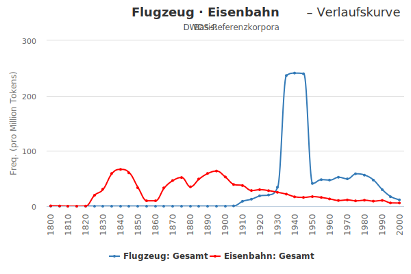

layout: true
  
<div class="my-header"></div>

<div class="my-footer">
  <table>
    <tr>
      <td>CLARIN-D &ndash; Common Language Resources and Technology Infrastructure</td>
      <td style="text-align:right"><a href="https://www.clarin-d.net/">www.clarin-d.net</a></td>
    </tr>
  </table>
</div>

---

class: title-slide

# Digitale Werkzeuge für die Zeitgeschichte:
## Eine Einführung in die digitale Hermeneutik und das Textmining

| Thomas Werneke  | Kay-Michael Würzner |
|:---------------:|:-------------------:|
| [werneke@zzf-potsdam.de](mailto:werneke@zzf-potsdam.de) | [wuerzner@bbaw.de](mailto:wuerzner@bbaw.de) |

---

# Überblick

- Vier Ziele:
  1. Vermittlung technischer Grundlagen
  2. Veranschaulichung der computerlinguistischen Verfahren anhand einfacher Beispiele
  3. Annäherung an die methodischen Herausforderungen der digitalen Hermeneutik
  4. Einstieg in fachlich relevante Fallbeispiele

---

# Digital turn?

- *Was sind Digitale Geisteswissenschaften?*
    + Neue Arbeitsweisen?
    + Neue Methodiken?
    + Eine neue Disziplin?

- *Alle arbeiten bereits „digital“*
    + mit Smartboards, Lernplattformen und digitalen Bildungsmedien
    + mit Online‐Katalogen der Bibliotheken und fachlichen Onlineportalen (z. B. HSozKult)
    + mit digitalen Werkzeugen (wie Googles „Ngram‐Viewer“)

---

# Google _Ngram_ – Fluch oder Segen?

Fallbeispiel: `love=>*_noun` im „English“-Korpus 
(10 häufigste Nomen in der Nähe von „love“)


---

class: title-slide

# Textkorpora

---

# Textkorpora

- Sammlungen von Texten
- *sprachwissenschaftliche* Referenzkorpora
    + repräsentative Erfassung der Gesamtheit einer Sprache (bzw. eines Sprachstandes)
    + Englisch: *British National Corpus* (Burnard, 1995)
    + Deutsch:
        * *DWDS-Kernkorpus* (Geyken, 2007)
        * *Deutsches Textarchiv* (Geyken und Klein, 2009)
- *Spezialkorpora*
    + repräsentative Erfassung eines speziellen Ausschnitts einer Sprache
    + **medial**: Zeitungskorpora, Filmuntertitelkorpora, Internetkorpora
    + **inhaltlich**: *Berliner Wendekorpus*, *JuSpiL-Korpus* (Dittmar, 2005)
    + **forschungsbezogen**: *childLex* (Schroeder et al., 2014)

---

# Textkorpora an der BBAW

- große Auswahl an **gegenwartssparchlichen**
    + DWDS-Kernkorpus, -Ergänzungskorpus
    + Zeitungskorpora (*Die ZEIT*, *Spiegel (online)*, Auswahl *Bild, Welt* etc.)
    + Spezialkorpora (Filuntertitel, politische Reden, Bundestagsprotokolle und -drucksachen)
- und **historischen** Korpora
    + DTA-Kernkorpus
    + DTA-Ergänzungen (Auswahl *Wikisource*, Auswahl *Gutenberg*, Auswahl *Mannheimer historische Zeitungen* etc.)
    + *Dinglers Polytechnisches Journal*
    + *Die Grenzboten*
- **einheitliche Architektur** für Annotation, Indizierung und Auswertung und **Präsentation**: [dstar](http://kaskade.dwds.de/dstar)

---

class: title-slide

# Linguistische Annotation

---

# Linguistische Annotation

- Ist: Text als lineare Folge von Zeichen
- Soll:
.center[]

---

# Linguistische Annotation

- zum Begriff der Linguistischen Annotation
    + Auszeichnung bestimmter linguistischer Eigenschaften
    + Bezug zu einer Einheit des Textes:
        * **Wort**: Silbenstruktur, morphologische Zerlegung, lexikalische
Semantik etc.
        * *Wortgruppe*: Mehrwortausdrücke, Namen, Kollokationen etc.
        * *Phrase*: syntaktische Kategorie, syntaktische Funktion
        * *Satz*: syntaktische Struktur, Satzsemantik, Funktion im Text
    + *manuelle* vs. *automatische* Annotation
- Annotation von Korpora
    + Strukturierung und Anreicherung der Rohtexte zum Zwecke
        * besserer Durchsuchbarkeit
        * einfacherer Belegidentifikation
        * moderner Korpuspräsentationsformen
        * quantitativer Auswertungen
    + Korpusumfang bedingt vollautomatische Analysekette

---

# Linguistische Annotation

- Beispiel:

| Text | *Aerzte* | *ſind* | *des* | *HERRgotts* | *Menſchenflikker* |
|------|----------|--------|-------|-------------|-------------------|
| Normalisiert | *Ärzte* | *sind* | *des* | *Herrgotts* | *Menschenflicker* |
| Lemma | *Arzt* | *sein* | *die* | *Herrgott* | *Menschenflicker* | 
| Tag | `NN` | `VAFIN` | `ART` | `NN` | `NN` |
| Grammatik | `Subjekt` | `Prädikat` | `Objekt` | `Objekt` | `Objekt` |

---

# Linguistische Annotation

- Analysekette:
    + Zerlegung des Fließtextes in Wörter und Sätze: **Tokenisierung**
    + Bestimmung der Grundform der Wörter: **Lemmatisierung**
    + Bestimmung der tatsächlichen Wortart eines Wortes: **PoS-Tagging**
    + Klassifizierung der Beziehungen der Wörter untereinander: **Dependenzparsing**
    + Auszählen gemeinsamer Vorkommen von Wörtern bzw. Wortgruppen: **distributionelle Semantik**
- vollautomatisch möglich (mit akzeptabler Qualität)
- zwei grundsätzliche Ansätze der Modellierung:
    + auf Basis von Expertenwissen **manuell** erstellte Regeln
    + auf Basis manuell erstellter Beispiele **automatisch** induzierte Regeln

---

# Tokenisierung

- Unterteilung von Fließtext in **Wörter** (bzw. *Tokens*) und **Sätze**
- (Vor-)Klassifizierung der Tokens zur Beschleunigung der morphologischen Analyse
    + Abkürzungen
    + Zahlen
    + Sonderzeichen
    + Fremdalphabete
- Normalisierung der Worttrennung
- Ansatz: Trennung an Leerraum
- statistischer Ansatz, **überwachtes Lernen**

---

# Tokenisierung

Problembereich *Satz*
```
Nach einer Schätzung des Industrieministeriums sind es mehr als 800.
»Österreich wurde alleingelassen in Europa«, beschwerte sich SPÖ-
Zentralsekretär Josef Cap.
SZ: Auf die Wahlerfolge der rechtsradikalen Parteien ...
```
Problembereich *Token*
```
Kaiser's-Netz → Kaiser 's-Netz
Jeanne d'Arc → Jeanne d' Arc
mm. → mm. [ORD]
CDU/CSU → CDU / CSU
(Verwaltungs-)Personal → ( Verwaltungs- ) Personal
```

---

# Morphologische Analyse

- Aufgabe
    + Bestimmung der **möglichen** Wortarten eines Wortes
      ```
      grünen ↦ {Verb, Adjektiv}
      Müller ↦ {Substantiv, Eigenname}
      ```
    + Abbildung auf eine kanonische **Grundform** (*Lemma*)
      ```
      grünen  ↦ grün
      Müllers ↦ Müller
      ```
    + Identifikation der beteiligten Wortbildungsprozesse
      ```
      Grünspan ↦ grün<A>#Span<N>
      verirren ↦ ver<p>+irren<V>
      ```

---

# Morphologische Analyse

- Verfahren des maschinellen Lernens nicht geeignet
- Herausfordend für Sprachen mit komplexer Wortbildung
- `Finite State Morphology` (klassischer regelbasierter Ansatz):
    + Man nehme
        * eine **große** Liste einfacher Wörter
        * deren **morphosyntaktische** Eigenschaften
        * Vor- und Nachsilben,
    + packe dies in einen **endlichen Automaten** und
    + bilde dessen **Kleenesche Hülle**
- Bestandteil der meisten Sprachverarbeitungssysteme

---

# Morphologische Analyse

- Illustration
    + Lexikon `{schön<A>,Geist<N>}`
    + Vorsilben `{un<p>,ur<p>}`
    + Nachsilben `{heit<N>,lich<A>}`

.center[.img-orig[]]

---

count: false

# Morphologische Analyse

- Illustration
    + Lexikon `{schön<A>,Geist<N>}`
    + Vorsilben `{un<p>,ur<p>}`
    + Nachsilben `{heit<N>,lich<A>}`

.center[.img-orig[]]

---

count: false

# Morphologische Analyse

- Illustration
    + Lexikon `{schön<A>,Geist<N>}`
    + Vorsilben `{un<p>,ur<p>}`
    + Nachsilben `{heit<N>,lich<A>}`

<center></center>

---

count: false

# Morphologische Analyse

- Illustration
    + Lexikon `{schön<A>,Geist<N>}`
    + Vorsilben `{un<p>,ur<p>}`
    + Nachsilben `{heit<N>,lich<A>}`

<center></center>

---

count: false

# Morphologische Analyse

- Illustration
    + Lexikon `{schön<A>,Geist<N>}`
    + Vorsilben `{un<p>,ur<p>}`
    + Nachsilben `{heit<N>,lich<A>}`

<center></center>

---

count: false

# Morphologische Analyse

- Illustration
    + Lexikon `{schön<A>,Geist<N>}`
    + Vorsilben `{un<p>,ur<p>}`
    + Nachsilben `{heit<N>,lich<A>}`

<center></center>

---

# PoS-Tagging

- Auswahl der **wahrscheinlichsten Wortart** im konkreten Satzkontext aus der Menge der **möglichen** Wortarten eines
Wortes
- statistischer Ansatz, trainiert auf **manuell kategorisierten** Daten
    + Modell über Trigramme aus Wörtern und Kategoriemengen (i. e. Wortklasse)
    + Bestimmung der wahrscheinlichsten Kategoriesequenz für einen Satz
    + heuristische Auswahl der „einfachsten“ **Grundform**
    + angepasste Modelle für historische Sprache, gesprochene Sprache, Kindersprache etc.
- `TreeTagger` als bekanntestes, frei verfügbares Werkzeug

---

# PoS-Tagging

.center[]

---

count: false

# PoS-Tagging

.center[]

---

# Wortverlaufskurven

+ **Häufigkeit eines Wort über einen zeitlichen Verlauf**
+ nutzen Textsammlungen als Basis, z. B.:
    - Zeitungen (1945 bis heute)
    - Deutsches Textarchiv und DWDS-Kernkorpus (1600&ndash;2000)
+ Metadaten für jeden Text:
    - *Datum* (Jahr)
    - *Textklasse* (Belletristik, Gebrauchsliteratur, Wissenschaft, Zeitung)
    - und viele weitere (i. e. beliebige DDC-Abfragen)
+ Darstellung:
    - relativ (Vorkommen pro Million)
        + 
.red[Achtung!] Kurven werden häufig geglättet, da nicht für jedes Jahr ausreichend und gleich viele Daten verfügbar sind
    - in absoluten Zahlen

---

# Wortverlaufskurven

.center[]

---

# Wortverlaufskurven

.center[]

---

# Wortverlaufskurven

.center[]

---

# Typische Verbindungen

- **DWDS-Wortprofil**
    + statistisch signifikante und damit typische Wortverbindungen
    + als Schlagwortwolke (Tagcloud) oder als Tabelle
    + kombiniert distributionelle Semantik mit Dependenzparsing

.center[.img-orig[]]

---

# Typische Verbindungen

.center[]

---

# Distributionelle Semantik

- Semantik: Theorie von der sprachlichen Bedeutung
    + **lexikalische** Semantik: Wortbedeutungen
    + **kompositionelle** Semantik: Phrasen- und Satzbedeutung
    * **ontologische** Beziehungen: Synonyme, Hyponyme, Hyperonyme
- mit automatischen Verfahren sehr schwer zu erfassen
- distributionelle Ähnlichkeit: gleiche Kontexte ⇒ ähnliche Bedeutung
- <span style="font-variant:small-caps;">John Rupert Firth</span> (1890&ndash;1960)
    + »You shall know a word by the company it keeps« (1957)
    + `Er versenkte den .... im Tor.`

---

count: false

# Distributionelle Semantik

- Semantik: Theorie von der sprachlichen Bedeutung
    + **lexikalische** Semantik: Wortbedeutungen
    + **kompositionelle** Semantik: Phrasen- und Satzbedeutung
    * **ontologische** Beziehungen: Synonyme, Hyponyme, Hyperonyme
- mit automatischen Verfahren sehr schwer zu erfassen
- distributionelle Ähnlichkeit: gleiche Kontexte ⇒ ähnliche Bedeutung
- <span style="font-variant:small-caps;">John Rupert Firth</span> (1890&ndash;1960)
    + »You shall know a word by the company it keeps« (1957)
    + `Er versenkte den Ball im Tor.`

---

# Distributionelle Semantik

- Vorgehen:
    + Man definiere einen **Kontext** (z.&#x202f;B. Satz) und **interessante** Wörter,
    + werfe für jedes Zielwort alle interessanten Wörter (z.&#x202f;B. *Nomen* und *Verben*) aus dem Kontext in einen Topf (*Bag of Words*),
    + repräsentiere den Topf als **hochdimensionalen Vektorraum** und
    + vergleiche die Vektoren miteinander.
- Illustration:
    + `Der Säufer randalierte in der Kneipe. Die Polizei sperrte den Säufer ein, weil er randalierte.`
.right[]

---

# Dependenzparsing

- Bestimmung der **strukturellen** Beziehungen zwischen Wörtern im Satz
- **regelbasierter** Ansatz
    + handgeschriebene Grammatik
    + Grundform, Kategorie und morphosyntaktische Merkmale als Beschreibungseinheit
    + Implementierung mit Hilfe endlicher, gewichteter Automaten
(schnell!)

---

# Dependenzparsing

.center[]

---

# Typische Verbindungen

+ Wortvergleiche: Gemeinsamkeiten und Unterschiede <span style="color:#5B7BB6;font-weight:bold">verkünden</span> und <span style="color:#c30c60;font-weight:bold">bekanntgeben</span>

.center[]

---

# Spiel: Profilardy

.center[[**Klick mich!**](https://docs.google.com/presentation/d/1qPfvBRmpPNAV6Y3zHGoYXAj-MuKy84E1ZJPvgMjwezA)]

---

class: title-slide

# Digitale Hermeneutik

---

# Operationalisierung digitaler Tools
Wie geht der Forscher mit quantitativen Ergebnissen um?
- Grundvoraussetzung ist Kenntnis über die Arbeitsweise digitaler Tools
- Vorgehen: Integration von **Distant Reading**-Methoden und klassischen **Close Reading**-Ansätzen
- Ziel: Etablierung einer neuen hermeneutischen Methode: **Digitale Hermeneutik**

---


# Distant Reading

- Definition:
  * ...
- Verfahren:
  1. Volltextsuche
  2. Lexikometrie und Korpusstatistik
  3. Methoden maschinellen Lernens/ Topic modelling
  4. Netzwerkanalysen
- **Wichtig:** Voraussetzung hierfür sind immer entsprechend annotierte Text-Korpora


---

# Der Weg zur Digitalen Hermeneutik?

Fünf neue Basisfertigkeiten nach Andreas Fickers (Luxemburg):
- Algorithmuskritik
- Datenkritik
- Werkzeugkritik
- Interface-Kritik
- Simulationskritik

---

# Close + Distant = Blended Reading?

> *„Unter dem Begriff des ‚blended reading‘ schlagen wir eine Strategie im Sinne einer Best Practise vor, die semiautomatische Analyseverfahren mit klassischer Textlektüre so integriert, dass sozialwissenschaftliche Erkenntnispotenziale, die sich auf die Auswertung großer Textdatenmengen stützen, optimal ausgeschöpft werden.“*<br />
> Stulpe/Lemke (Textmining in den Sozialwissenschaften, 2016, S. 21)

---

class: title-slide

# Blended Reading und die Kollokationsanalyse mit DiaCollo

---

# Definition: Kollokation

- *Kollokation* bezeichnet häufiges gemeinsames Auftreten zweier Wörter in vordefiniertem Kontext (Satz, Absatz etc.)
  + enge semantische Beziehungen (*Schüler* → *Lehrer*) 
  + Sachverhalte (*Schule* → *Reform*) 
  + feste Phrasen (*Hänschen* → *Hans*)
- **Grundidee:**
  + Ermittlung aller Kollokationen eines Eingabebegriffes
  + Ordnung nach deren Assoziationsgrad zum Eingabebegriff
  + Beispiel [*Begriff*](http://kaskade.dwds.de/dstar/dta/diacollo/?query=Begriff&date=&slice=50&score=ld&kbest=20&cutoff=&profile=2&format=cloud&groupby=&eps=0) im DTA

---

# Diachrone Kollokationsanalyse

> *„Die Bedeutung eines Wortes ist sein Gebrauch in der Sprache.“*<br />
> Ludwig Wittgenstein (Philosophische Untersuchungen)

- DiaCollo ermöglicht die Analyse von Sprachwandel, indem es die historische (Zeit-)Dimension in großen digitalen Textkorpora visualisiert
  + Untersuchungszeiträume frei skalierbar (jahresweise, dekadenweise etc.)
  + Visualisierungsoptionen für Abfrageergebnisse (Wordclouds, Bubble, Gmotion, HTML‐Listen)
- getestet an großen und mittelgroßen Korpora, darunter *Die Grenzboten* und *DDR-Presseportal*

---

# Weitere Informationen unter:

[http://kaskade.dwds.de/dstar/dta/diacollo/](http://kaskade.dwds.de/dstar/dta/diacollo/)
[http://kaskade.dwds.de/diacollo‐tutorial/#introduction.html](http://kaskade.dwds.de/diacollo‐tutorial/#introduction.html)
[https://clarin‐d.net/de/kollokationsanalyse‐in‐diachroner‐perspektive](https://clarin‐d.net/de/kollokationsanalyse‐in‐diachroner‐perspektive)


---

class: title-slide

# Fallbeispiele

---

# Fallbeispiele - Vorgehenweise

- *Explorativ*
  + Wordstatistiken und Verlaufskurven
  + signifikante Veränderungen im Inhaltswortbereich
  + Hinweise auf Bedeutungsverschiebung bzw. Bezeichnungswandel

- *Hypothesengeleitet*
  + spezifische Korpusrecherchen zur effizienten Belegauswahl
  + Belegauswertung
  + quantitatives „Untermauern“

---

# Antisemitismus in den *Grenzboten*


- Nationalliberale Zeitschrift „Die Grenzboten“
  + Erscheinungszeitraum 1841 bis 1922 wöchentlich, zeitweise zweiwöchentlich
  + Insgesamt ca. 270 Bände (ca. 187 000 Seiten)
- Digitalisierung an der SuUB Bremen im Rahmen zweier DFG-Projekte
  + Erschließung von Volltext **und** Struktur 
  + seit 2017 auch in CLARIN-D integriert

---

# Antisemitismus in den *Grenzboten*

Methodik:
- **Schritt 1**: Deduktive Eingrenzung eines vielversprechenden Zeitraumes
  + die 1880er Jahre und der Antisemitismusstreit
- **Schritt 2**: Suche nach Kollokaten, (hier Nomen `NN`), für den Wortstamm „Jude“
  + Auswahl ungewöhnlicher Kollokate, die auf Ressentiments  hinweisen
- **Schritt 3**: Analyse der Textpassagen via Funktion `key word in context` (KWIC)
  + konventionelle Quellen‐Exegese

---

# Antisemitismus in den *Grenzboten*

Einfache Suchabfrage nach dem Lemma „Jude“


---

# Antisemitismus in den *Grenzboten*

*Close reading* Beispiel zu „Vermehrung“ und „Handel“

> *„Aber auch abgesehen von diesem Umstände erscheint die [Vermehrung](http://kaskade.dwds.de/dstar/grenzboten/dstar.perl?fmt=html&corpus=&limit=10&ctx=8&q=NEAR(+($l=@%27Jude%27%29+=1,+($l=@%27Vermehrung%27+WITH+$p=@%27NN%27%29+=2,+8%29+#SEPARATE+%23asc_date[1880-00-00,1889-99-99]+%23cntxt+1+%23in+p&_s=submit) der Juden noch viel zu bedeutend, um allein auf besonders günstige biotische Verhältnisse, auf größere Fruchtbarkeit und längere Lebensdauer, die ihnen nebenher nicht abgesprochen werden sollen, zurückgeführt werden zu können.“*<br />
> In: „Die Juden in Osterreich.“ Die Grenzboten, Jg. 41 (1882), S. 629.

> *„Der tüchtigste Bauer ist oft dem simpelsten Juden lange nicht gewachsen, wo es um Geld, [Handel](http://kaskade.dwds.de/dstar/grenzboten/dstar.perl?fmt=html&corpus=&limit=10&ctx=8&q=NEAR%28+%28%24l%3D%40%27Jude%27%29+%3D1%2C+%28%24l%3D%40%27Handel%27+WITH+%24p%3D%40%27NN%27%29+%3D2%2C+8%29+&_s=submit#SEPARATE+%23asc_date%5B1880-00-00,1889-99-99%5D+%23cntxt+1+%23in+p&_s=submit), um Schein und Hypothek und Wechsel geht.“*
> In: „Erdboden.“ Die Grenzboten, Jg. 59 (1900), S. 271.

---

# Antisemitismus in den *Grenzboten*

**Vorsichtiger Befund:** 
- Es lassen sich in den *Grenzboten* Stereotypen ausmachen, die auf kulturellen und biologisierenden Rassismus hinweisen. 
- Die Autoren bauten derartige rassistische Ressentiments in den 1880er Jahren in ihre Argumentation ein.

---

# Schule, Erziehung in den *Grenzboten*

- **Schritt 1:** Korpusstatistische Abfrage (über lexdb):
  + Identifizierung hochfrequenter [Begriffe](https://kaskade.dwds.de/dstar/grenzboten/lexdb/view.perl?select=w,p,l,sum(f%23+as+freq&from=lex&where=p+=+'NN'&groupby=l&orderby=freq+desc&offset=0&limit=100&_s=submit)
  + Auswahl interessanter Begriffe (hier: [*Schule*](https://kaskade.dwds.de/dstar/grenzboten/dstar.perl?fmt=hist&pformat=svg&q=Schule&_s=submit&n=date+class&smooth=none&gr=1&sl=1&w=1&wb=0&pr=0&xr=*:*&yr=0:*&psize=840,480&points=1))
  + Ermittlung hochfrequenter [Kompositaformen](http://kaskade.dwds.de/dstar/grenzboten/dstar.perl?fmt=kwic&corpus=&limit=100&ctx=8&q=count(/schule/i+#sep%23+#by[$l]+#desc_count&_s=submit) für *Schule*

- **Schritt 2:** Suchabfragen über DiaCollo:
  + häufigste Adjektive, Substantive, Eigennamen
  + Ermittlung von Debatten
  + Recherche in den Texten über KWIC

---

# *Schule*, *Erziehung* in den *Grenzboten*

Wortverläufe im Vergleich


---

# *Schule*, *Erziehung* in den *Grenzboten*

*Gymnasium* in DiaCollo


Kollokationen für *Gymnasium* in 1850er Jahren

Kollokationen für [*Gymnasium*](http://kaskade.dwds.de/dstar/grenzboten/diacollo/?query=@Gymnasium&date=&slice=10&score=ld&kbest=10&cutoff=&profile=2&format=cloud&global=1&groupby=&eps=0)" in 1870e Jahren

---

# *Schule*, *Erziehung* in den *Grenzboten*

Wortbeziehungen für *Erziehung* in DiaCollo
- [Adjektive](http://kaskade.dwds.de/dstar/grenzboten/diacollo/?query=@Erziehung&date=&slice=10&score=ld&kbest=20&cutoff=&profile=2&format=cloud&global=1&groupby=l,p=ADJA&eps=0)
  + häuslich, sittlich (1850er)
  + weiblich, ästhetisch (1870er)
  + national und dann staatsbürgerlich (1910er)
- [Nomen](http://kaskade.dwds.de/dstar/grenzboten/diacollo/?query=@Erziehung&date=&slice=10&score=ld&kbest=20&cutoff=&profile=2&format=cloud&global=1&groupby=l,p=ADJA&eps=0)
  + Menschengeschlecht (Lessings Hauptwerk von 1780)
  + Jugend/ Kind (1860er)
  + Unterricht, Schule und Ausbildung treten hinzu (1870er)
- [Eigennamen](http://kaskade.dwds.de/dstar/grenzboten/diacollo/?query=@Erziehung&date=&slice=10&score=ld&kbest=20&cutoff=&profile=2&format=cloud&global=1&groupby=l,p=ADJA&eps=0)
  + Frankreich (1840er)
  + Hegel, Lessing, Fichte, Schiller, Rousseau (1860–1880)
  + Paul Güßfeldt, Georg Kerschensteiner (1890–1910)

---

# DDR-Presseportal


- drei DDR-Zeitungen:
  + *Neues Deutschland*
  + *Berliner Zeitung*
  + *Neue Zeit*
- im Rahmen eines CLARIN-D-Kurationsprojektes aufbereitet

---

# Forschungsstand DDR-Pressesprache

- ideologisch motivierte Entdifferenzierung von Sprache, semantische Verknappung
- extensive Nutzung von Hochwertwörtern wie „Frieden“
- Ritualisierung des Berichtsstils, -tons, und der Sprache
- DDR-Presse diente als ein „Verlautbarungsorgan“ der SED, um Entscheidungen des Politbüros zu verkünden.

---

# DDR-Pressportal: „Jahr 2000“

- signifikanter Anstieg der Vorkommenshäufigkeit seit Mitte der 1980er-Jahre
- Intuition des Forschers: schwindende utopische Perspektive in der DDR-Presse


---

# DDR-Pressportal: „Jahr 2000“

- Ursprünglich: utopischer Fluchtpunkt für umfangreiche soziale und ökonomische Entwicklungen in der kommunistischen Integrationszone
- Aber: mehr und mehr auch als Begriff zur Markierung des realen Übergangs ins reale Jahr 2000:
    + Das Millennium wird zur Schwelle, die tatsächlich überquert werden kann,
    + verdeutlicht durch Wendungen wie „darüber hinaus“.


---

# Ritualisierung der Presseprache


---

# Entdifferenzierung der Pressesprache

- **Schritt 1**: Identifikation von hochfrequenten Begriffen mittels korpusstatistischer Auswertung
- **Schritt 2**: Auswahl interessanter Begriffe wie „Wohl“ oder „Sorge“
- **Schritt 3**: Abfrage dieser Begriffe über DiaCollo
- **Schritt 4**: Auswertung typischer Kollokate

---

# Entdifferenzierung der Pressesprache

Identifikation hochfrequenter Begriffe im Korpus


Häufigste Nomen im Gesamtkorpus (Menschen, Leben, [Tanzen], Welt)

---

# Modulare Sprache in der DDR-Presse


Kollokationen zu „Wohl“ in den 50ern (ND, nur Nomen)

Kollokationen zu "Wohl" in den [1980er Jahren](http://kaskade.dwds.de/dstar/nd/diacollo/?query=Wohl&_s=submit&date=&slice=10&score=ld&kbest=20&cutoff=&profile=2&format=cloud&groupby=l%2Cp%3DNN&debug=1&eps=0)

---

# Modulare Sprache in der DDR-Presse

Exemplarisches Muster für die modulare Sprache


---

# Der Begriff „Bürgernähe“

Sprachtransfer in die DDR-Presse?
- **qualitativer Befund:**
  + Suche nach „Bürgernähe“ als Begriff in der Sprache des SED-Regimes
  + **kein** Begriff der offiziellen Herrschaftssprache
- **quantitativer Vergleich:**
  + ZEIT-Korpus (BBAW)
  + DDR-Presseportal

---

# Der Begriff „Bürgernähe“

- **Ergebnisse ZEIT:**
  + erster Beleg 1971
  + formulierter Anspruch an die (kommunale) Verwaltung
  + Ende der 1970er Jahre als direkte Aufgabe der Politik formuliert
  + etwa gleichbleibende Frequenz in 1970er und [leicht rückläufig](http://kaskade.dwds.de/dstar/zeit/dstar.perl?fmt=hist&pformat=svg&q=B%C3%BCrgernah&_s=submit&n=abs&smooth=none&sl=1&w=1&wb=0&pr=0&xr=1949%3A1990&yr=0%3A*&psize=840%2C480) in 1980er Jahren
- **Ergebnisse DDR-Presseportal:**
  + erster Beleg 1979 in Berliner Zeitung
  + auch hier stark auf Verwaltung bezogen
  + Gegenbegriff „Bürokratismus“
  + starker [Anstieg der Frequenz](http://kaskade.dwds.de/dstar/nd/dstar.perl?ctx=8&q=B%C3%BCrgernah&start=1&limit=10&fmt=hist) in den Jahren 1987-1989
